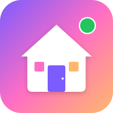
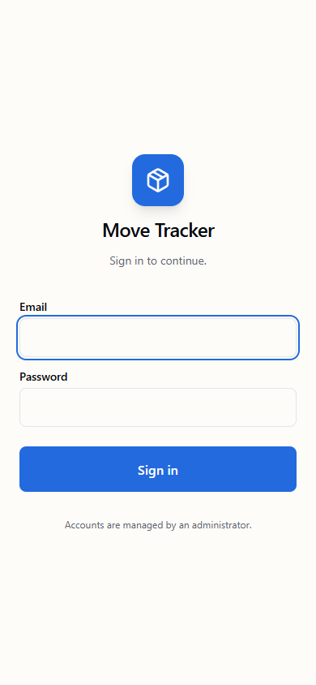
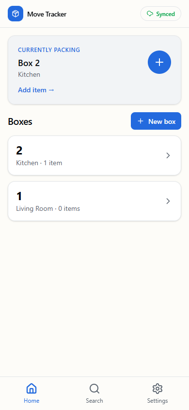
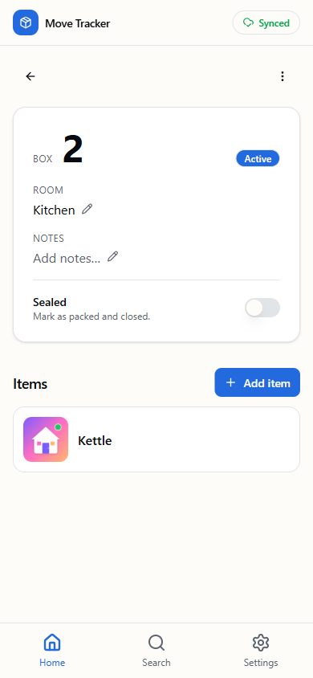
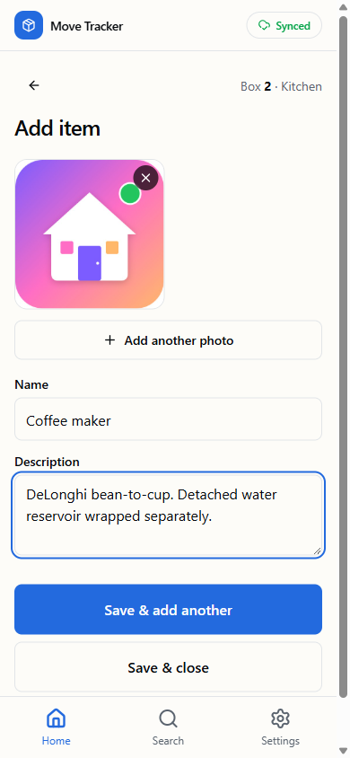
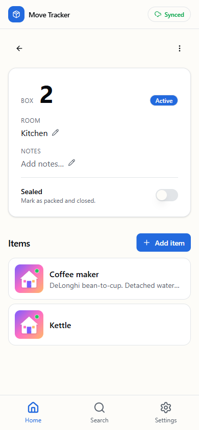
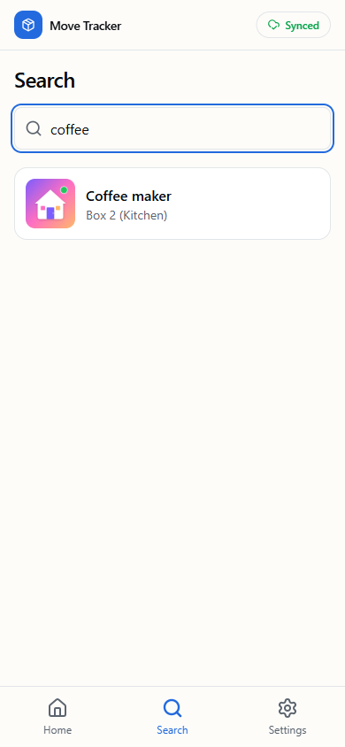
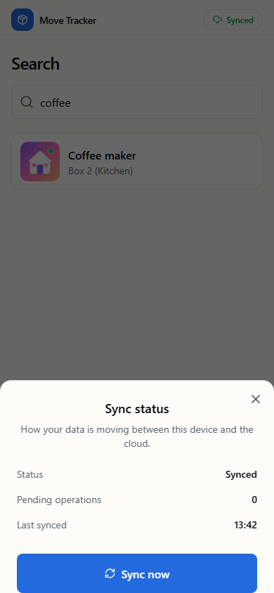

<div align="center">
  
  <h1>Move Tracker</h1>
  <p>
    <strong>A mobile-first PWA for tracking what's in every box of your house move.</strong>
  </p>
  <p>
    Two people, one shared inventory, fully offline-capable. Snap a photo, type a name, hit save — the box number, room, sync, and search just work.
  </p>
  <p>
    <a href="#features">Features</a> ·
    <a href="#screens">Screens</a> ·
    <a href="#stack">Stack</a> ·
    <a href="#getting-started">Getting started</a> ·
    <a href="#how-it-works">How it works</a>
  </p>
</div>

---

## The problem

Moving house with a partner is a logistical nightmare. You wrap a thing, you put it in a box, and three weeks later in the new place you're standing over thirty cardboard cubes asking: *"which one has the kettle?"*

Move Tracker solves the search problem. Anyone with the app can scan an item into a box in a few seconds, and on day one in the new house anyone can look up *"kettle"* and see exactly which numbered box to open and which room it's headed to.

## Features

- **Optimised for one-handed packing.** Auto-opens the camera on the add-item screen, autofocuses the name field after the photo, and the primary save button keeps you in the box context for the next item. No taps wasted.
- **Numbered boxes assigned automatically.** "Will be **Box 12**" appears before you even start so you can grab the marker. Numbers are unique across both users with collision recovery if you ever both create at the same time offline.
- **Photos compressed on-device.** Every photo is downscaled to ≤0.5 MB before upload. No battery- or data-burning 4 K JPEGs.
- **Two users, one shared dataset.** Both partners see and edit the same inventory in real-time. RLS keeps everything else out.
- **Full-text search.** Backed by Postgres `tsvector` online and IndexedDB locally — search "kettle" or "DeLonghi bean-to-cup" and it finds it.
- **Genuinely offline.** App shell, all reads, and all writes work with no network. Changes queue in an outbox and drain transparently when you're back online.
- **Installable PWA.** Add to Home Screen on iOS or Android and it behaves like a native app — full-screen, splash, app icon.
- **Last-write-wins conflict resolution** with an in-app explainer so it's not a black box.
- **Active box card** at the top of the home screen so you can return to packing in one tap.

## Screens

<table>
  <tr>
    <td align="center">
      <br/>
      <sub><b>Login</b><br/>Email + password, no public signup.</sub>
    </td>
    <td align="center">
      <br/>
      <sub><b>Home</b><br/>Active-box card and box list.</sub>
    </td>
    <td align="center">
      <br/>
      <sub><b>Box detail</b><br/>Inline-editable room/notes, seal toggle.</sub>
    </td>
  </tr>
  <tr>
    <td align="center">
      <br/>
      <sub><b>Add item</b><br/>Camera-first, name autofocused.</sub>
    </td>
    <td align="center">
      <br/>
      <sub><b>Items list</b><br/>Photos lazy-loaded from signed URLs.</sub>
    </td>
    <td align="center">
      <br/>
      <sub><b>Search</b><br/>Server FTS online, local <code>LIKE</code> offline.</sub>
    </td>
  </tr>
  <tr>
    <td align="center">
      <br/>
      <sub><b>Sync sheet</b><br/>Pending count, last-sync time, force resync.</sub>
    </td>
    <td></td>
    <td></td>
  </tr>
</table>

## Stack

| Layer | Choice |
|---|---|
| Framework | **Next.js 16** (App Router) + TypeScript strict |
| Styling | **Tailwind v4** + shadcn-style components |
| Auth + DB + Storage | **Supabase** (a single provider for all three) |
| Data fetching | **TanStack Query** with offline-friendly retry |
| Local DB | **Dexie** (IndexedDB) — mirrors the server schema |
| PWA / service worker | **Serwist** |
| Image compression | **`browser-image-compression`** (web worker) |
| Forms | **React Hook Form** + **Zod** |
| Hosting | **Vercel** |

## Getting started

### 1. Supabase setup

You can do this in ~5 minutes with the included scripts.

1. Create a new project at [supabase.com](https://supabase.com).
2. Connect it to Vercel via the [Supabase Vercel integration](https://vercel.com/marketplace/supabase) — this auto-populates `NEXT_PUBLIC_SUPABASE_URL`, `NEXT_PUBLIC_SUPABASE_ANON_KEY`, and `SUPABASE_SERVICE_ROLE_KEY` on your project.
3. Locally:
   ```bash
   npm install
   vercel env pull .env.local         # fetches the secrets from Vercel
   node scripts/setup-supabase.mjs    # runs both SQL migrations + creates the storage bucket
   node scripts/create-users.mjs      # creates 2 user accounts with strong random passwords (one-shot)
   ```
4. **In the Supabase dashboard**, go to *Authentication → Sign In / Providers* and toggle **"Allow new users to sign up"** OFF. The CLI can't do this — Supabase requires a Personal Access Token for project-config changes.

That's it. RLS, triggers, the seeded room list, the private `item-photos` storage bucket, and your two user accounts are all live.

> The first time you run `setup-supabase.mjs` and `create-users.mjs` on this account, save the printed passwords — they're only shown once.

### 2. Local dev

```bash
npm run dev
# http://localhost:3000
```

Sign in with one of the accounts you created. Add to Home Screen on a phone for the full PWA experience.

### 3. Deploy

If you used the Supabase Vercel integration, every push to `main` deploys automatically. Otherwise:

```bash
vercel --prod
```

## How it works

### Offline-first data layer
Every read goes to IndexedDB first (instant). Every write is committed to IndexedDB optimistically and queued in an outbox. The sync engine drains the outbox to Supabase whenever the device is online, then runs a delta pull (`updated_at > last_sync_at`) for anything updated by the other user.

```
 user action ──► Dexie (instant, _dirty=1) ──► outbox ──► [online] ──► Supabase
                       ▲                                                 │
                       └─────── delta pull ◄──────────────────────────────┘
```

### Box numbering
Box numbers are assigned client-side as `MAX(local box number) + 1`. If two users create a box while offline and a unique-constraint collision happens at sync, the loser is renumbered locally and the user sees a toast: *"Box renumbered from 12 → 14. Please update the marking on your box."*

### Photo flow
1. Camera opened via `<input type="file" accept="image/*" capture="environment">`.
2. Compressed in a web worker to ≤0.5 MB / 1600 px JPEG.
3. Stored as a Blob in IndexedDB until the upload outbox entry processes.
4. On sync: uploaded to Supabase Storage at `{user_id}/{item_id}/{photo_id}.jpg`, then the `item_photos` row is inserted.
5. On display: `URL.createObjectURL(blob)` while local, signed Storage URL once uploaded.

### Conflict resolution
**Last-write-wins on `updated_at`.** Acceptable for a two-user use case — two people rarely edit the same row at the same time — and surfaced in the in-app *Settings → How sync works* explainer.

### Auth
Public signup is disabled in the Supabase dashboard. Both users get full CRUD via a permissive RLS policy. Anonymous users get nothing. The Next.js [proxy.ts](proxy.ts) refreshes the Supabase session cookie on every request and gates non-public routes behind auth.

## Project structure

```
app/
  (auth)/login/                 — login screen
  (app)/                        — auth-gated screens
    page.tsx                    — home (box list)
    box/new/                    — create box
    box/[id]/                   — box detail
    box/[id]/add-item/          — packing screen
    item/[id]/                  — item detail / gallery
    search/                     — search
    settings/                   — rooms, sync, sign out
  sw.ts                         — Serwist service worker source
components/
  ui/                           — shadcn-style primitives
  boxes/, items/, search/, ...  — feature components
  sync/                         — sync engine context + status indicator
lib/
  supabase/                     — browser + server clients, proxy session refresh
  db/dexie.ts                   — IndexedDB schema
  db/sync.ts                    — outbox drain, delta pull, collision handling
  repo/                         — boxes, items, rooms, photos data layer
  utils/                        — image compression, photo URL signing
hooks/                          — useActiveBox, useOnline, useCurrentUser
public/manifest.json + icons/   — PWA assets
supabase/migrations/            — SQL run by setup-supabase.mjs
scripts/
  setup-supabase.mjs            — SQL migrations + storage bucket creation
  create-users.mjs              — admin-creates the two user accounts
  gen-icons.mjs                 — regenerate PNG icons from inline SVG
proxy.ts                        — Next.js auth gate (Next 16 proxy convention)
```

## Out of scope (v1)

Item value field, CSV/PDF export, multiple "moves", bulk operations, in-app
photo editing, undo / trash, push notifications, "forgot password" flow,
per-user data isolation, magic-link auth, custom box numbering schemes.

## Notes

- Build uses `next build --webpack` because Serwist doesn't yet support Turbopack. `next dev` likewise.
- The first sign-in primes IndexedDB by pulling everything once. After that, only deltas (`updated_at > last_sync_at`) are fetched.
